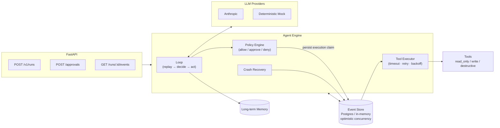
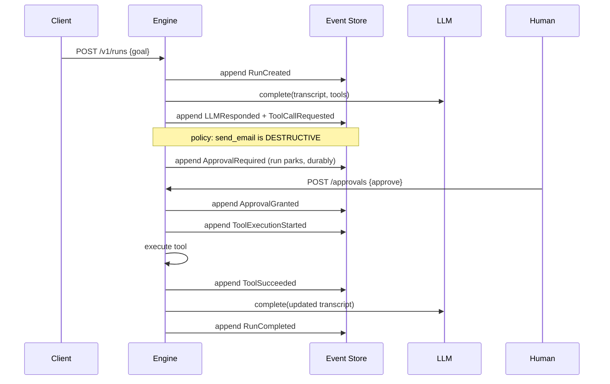
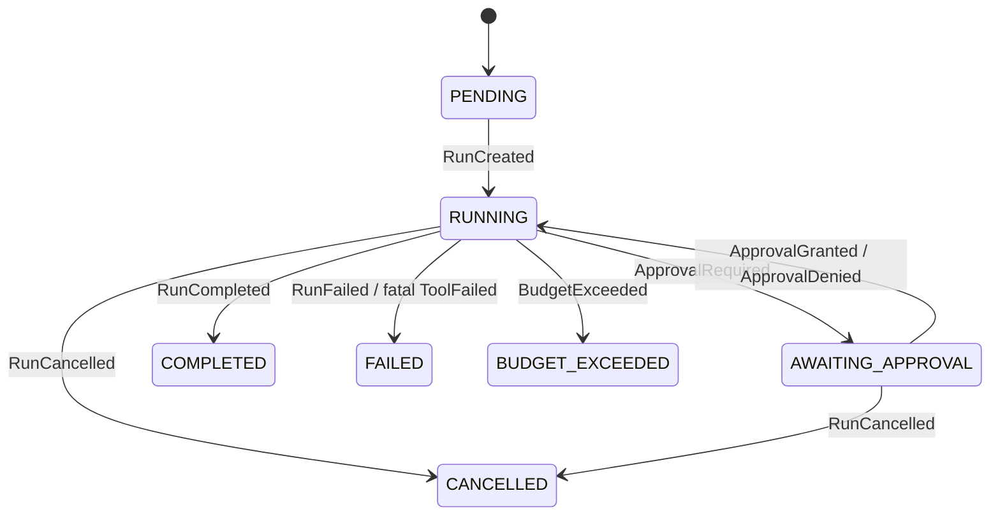

# Relay

**A durable, event-sourced runtime for AI agents.** Framework-free by design: the loop, state, recovery, and safety layers are built from first principles on raw provider SDKs, because those layers *are* the hard part of production agentic systems.

[]() []() []()

```
60 unit + integration tests · 6/6 behavioral evals (CI-gated) · runs with zero config, no API key
```

## The problem

Agent demos die in production for predictable reasons: the process crashes mid-task and all progress is lost; the agent loops forever and burns $400 of tokens; it calls a destructive tool nobody reviewed; and when something goes wrong, nobody can reconstruct *why* the agent did what it did.

Relay is the runtime layer that fixes those failure modes — not another agent framework, but the infrastructure an agent runs *on*:

| Production failure | Relay's answer |
|---|---|
| Worker crashes mid-run, progress lost | Event-sourced runs: every step is durable; recovery replays the log and resumes |
| Crash *during* a side effect ("did the email send?") | Persisted execution claims + idempotency contracts; ambiguous non-idempotent calls escalate to a human |
| Runaway loops, unbounded spend | Runtime-enforced budgets (steps, tokens, USD) — a circuit breaker, not a prompt suggestion |
| Unreviewed destructive actions | Policy engine + human-in-the-loop gates; runs park durably in `AWAITING_APPROVAL` |
| "Why did it do that?" | The event ledger IS the audit log; any run can be replayed step by step |
| Untestable, flaky agent behavior | Deterministic mock provider + behavioral eval suite that gates CI |
| Vendor lock-in | Neutral provider interface; Anthropic adapter included, Bedrock/others are one file |

## Architecture



The core idea: **a run is a ledger, not a row.** State is never mutated — every step appends an immutable event, and current state is derived by folding the log:



A crash at *any* arrow loses nothing: recovery replays the log and continues from the exact decision point.

### Run state machine



## Quick start

```bash
# zero-config: in-memory store + deterministic mock model, no secrets
pip install -e ".[dev]"
make demo     # watch 4 stories: tools, HITL approval, crash recovery, memory
make test     # 60 tests
make evals    # 6 behavioral scenarios (same suite gates CI)

# full durable stack: Postgres + API (+ optional Jaeger tracing)
docker compose up --build
curl -X POST localhost:8000/v1/runs -H 'content-type: application/json' \
     -d '{"goal": "What is (2+3)*7?"}'
curl localhost:8000/v1/runs/<run_id>/events   # read the ledger

# real model: set RELAY_PROVIDER=anthropic and ANTHROPIC_API_KEY in .env
```

## What's actually interesting here (the hard parts)

**1. Exactly-once is a lie; Relay is honest about it.** `ToolCallRequested` is persisted *before* execution, the result *after*. If a worker dies between the two, the ledger cannot know whether the side effect happened. Relay resolves the ambiguity by contract: tools declare `idempotent`; idempotent calls are re-executed on recovery, non-idempotent ones (send_email) are escalated to a human with full context. See `engine/recovery.py` and ADR-0003.

**2. Side-effect fencing without distributed locks.** Every append carries `expected_version`; before a tool runs, the worker must append `ToolExecutionStarted`. Racing workers cannot both win that execution claim, so only one reaches the handler. Provider calls may still be duplicated before one writer wins its response append, which wastes bounded spend but cannot fork ledger state. Postgres enforces append ordering with a row lock plus a composite PK. See `store/postgres.py` and ADR-0003.

**3. Budgets as circuit breakers.** `max_steps` / `max_tokens` / `max_cost_usd` are checked by the runtime before every model call. The eval suite includes an adversarial provider that loops forever — the run halts at exactly the step budget, every time.

**4. Safety as a policy layer, not a prompt.** Tools declare risk (`read_only` / `write` / `destructive`); a deny-by-default policy engine decides allow / require-approval / deny per call. Per-run tool allowlists are enforced by the registry — the model physically cannot invoke a tool it wasn't granted.

**5. Metrics that cannot lie.** Prometheus counters are derived from the same event stream as the ledger — recorded only after a successful append — so `/metrics` can never disagree with the audit log. Run-status gauges are computed from the projection at scrape time. Bounded label cardinality by design (`run_id` is never a label).

**6. Agent behavior is regression-tested.** The deterministic mock provider scripts exact model behavior, so CI asserts things like "a failed tool call is surfaced to the model, which then recovers" — impossible to test reliably against a live model. See `evals/`.

**7. Memory that's engineered, not implied.** Three tiers: working (transcript, rebuilt by the fold), episodic (the immutable ledger of every run), long-term (distilled lessons retrieved into future prompts — auditable, because injection happens before `RunCreated` is written).

## Repository map

```
src/relay/
├── domain/        events, run state machine (the fold), budgets — pure, no I/O
├── store/         EventStore protocol; Postgres + in-memory (same contract)
├── llm/           provider protocol; Anthropic + deterministic mock adapters
├── tools/         tool contract, registry, risk levels, policy engine, builtins
├── engine/        the loop, tool executor, crash recovery, run manager
├── memory/        long-term memory store + retrieval
├── observability/ OTel tracing (no-op fallback), structured JSON logging
└── api/           FastAPI: create/inspect/approve/cancel/replay runs
tests/             60 unit + integration tests
evals/             behavioral scenario suite (gates CI)
docs/              architecture, 6 ADRs, failure modes, runbook, limitations
```

## Documentation

| Doc | What it covers |
|---|---|
| [docs/architecture.md](docs/architecture.md) | Component walkthrough + design invariants |
| [docs/adr/](docs/adr/) | 6 decision records: event sourcing, no-framework, concurrency, providers, HITL, sandboxing |
| [docs/FAILURE_MODES.md](docs/FAILURE_MODES.md) | What breaks, how Relay behaves, what the blast radius is |
| [docs/RUNBOOK.md](docs/RUNBOOK.md) | Operating it: deployment, monitoring, incident procedures |
| [docs/EVALS.md](docs/EVALS.md) | Eval methodology + latest results |
| [docs/ai-system-design.md](docs/ai-system-design.md) | Goals, lifecycle, memory, safety, evaluation, and scaling tradeoffs |
| [docs/enterprise-readiness.md](docs/enterprise-readiness.md) | Control evidence, deployment gates, and residual production gaps |
| [docs/LIMITATIONS.md](docs/LIMITATIONS.md) | Honest list of what this doesn't do, and the production upgrade path for each |
| [AGENTS.md](AGENTS.md) | Binding standards for AI coding agents working on this repo (invariants, quality gates, security rules) |
| [agent-skills/](agent-skills/) | Procedural skills for common changes - add-tool, add-provider, add-event - each with a review checklist |

## Design stance: why no LangChain/CrewAI?

Frameworks optimize for the first demo; runtimes have to optimize for the ways things fail. Durable execution, optimistic concurrency, idempotency-aware recovery, policy enforcement, and cost circuit breakers are the substance of this project — hiding them behind a framework would leave nothing but glue code. The provider SDK is the only vendor surface, kept behind one interface (ADR-0002, ADR-0004).

## License

MIT
