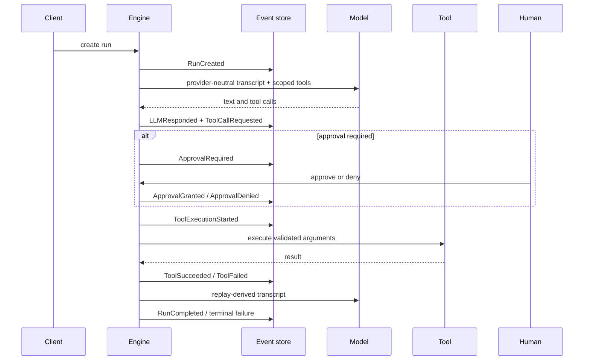

# AI system design

Relay is a runtime for durable, tool-using AI agents. Its design target is not
the best single model response; it is controlled progress across unreliable
models, tools, workers, and human approval delays.

## Goals and boundaries

| Goal | Mechanism | Deliberate boundary |
|---|---|---|
| Recover every durable step | Append-only event ledger + pure replay | No snapshots yet |
| Bound autonomous behavior | Step, token, and cost circuit breakers | Token/cost may overshoot by one call |
| Control side effects | Capability scoping, risk policy, approvals, execution claims | Tool risk is author-declared |
| Diagnose decisions | Provider-neutral transcript reconstructed from events | Prompts/tool outputs are sensitive data |
| Test agent behavior | Scripted provider + CI-gated scenarios | Live-model quality evals are not included |
| Avoid vendor lock-in | Neutral provider and tool protocols | One production provider adapter today |

Relay is not a model router, prompt-management platform, identity provider, or
arbitrary-code sandbox. Those concerns integrate at explicit boundaries rather
than being implied by prompts.

## Durable request lifecycle

The event order is the reliability protocol. Request intent is durable before a
side effect. `ToolExecutionStarted` is an optimistic-concurrency fence: two
workers may observe the request, but only one can claim that event version and
enter the handler. If a worker dies after the claim, recovery uses the tool's
idempotency declaration to re-execute or ask a human.

Exactly-once external side effects are not claimed. A crash after an email is
sent but before `ToolSucceeded` is appended remains ambiguous; the ledger makes
that ambiguity inspectable.

## State, memory, and context

Working state is not mutated. `domain/run.py` folds the ledger into an immutable
`RunState`, including transcript, pending calls, approval state, budgets, and
usage. The engine replays before each decision, so cancellation and approvals
from another writer naturally participate in the next transition.

Memory has three distinct roles:

1. **Working memory:** the current transcript, reconstructed by replay.
2. **Episodic memory:** the complete per-run ledger.
3. **Long-term memory:** distilled completed-run lessons behind `MemoryStore`.

Retrieved long-term memories are included in `RunCreated.system_prompt`, making
their influence auditable. The current JSONL/keyword implementation is a
single-node reference implementation, not an enterprise vector store.

## Governance and security

Model output and tool arguments are untrusted. Controls are runtime paths:

- a run-scoped registry limits visible and executable capabilities;
- tool risk maps to allow, approval, or deny;
- destructive tools require human approval by default;
- execution claims fence racing side effects;
- executor timeouts, retries, and output caps contain tool failures;
- provider timeouts and retries bound stalled model calls;
- calculator complexity and magnitude are capped;
- HTTP reads use scheme/domain allowlists and reject redirects;
- file writes are size-bounded and confined to a workspace.

Residual controls required for a production deployment are OIDC/RBAC, tenant
isolation, external sandboxing for code execution, secret-managed policy
configuration, and hardened network egress.

## Evaluation strategy

Unit tests pin the fold, stores, policy, tools, retries, API semantics, and
recovery. Integration tests exercise the real loop with only the model replaced
by a deterministic script. Six behavioral scenarios gate:

- grounded tool use and multi-step chaining;
- recovery from malformed tool arguments;
- budget termination of a looping agent;
- destructive-action approval;
- capability allowlist enforcement;
- a universal claim-before-tool-success concurrency invariant.

These evals measure runtime behavior deterministically. Model quality requires a
separate statistical suite using representative tasks, repeated live calls,
quality graders, latency distributions, and cost thresholds.

## Performance and scaling

Replay is O(events per run), currently appropriate because budgets keep ledgers
short. Tool calls are sequential for simple recovery semantics. Provider calls
and tools are bounded by timeouts. Output and write sizes are capped.

The current scheduler is single-node. The event store protects ledger and tool
side-effect correctness across racing writers, but duplicate provider calls can
still waste spend. Fleet scale requires projection leases with heartbeats,
queue-based work distribution, and stale-lease recovery. Snapshots become useful
only when long-running ledgers make replay measurable.

## Design tradeoffs

- **Event sourcing over mutable rows:** stronger recovery and auditability at
  the cost of replay and schema discipline.
- **Explicit runtime over an agent framework:** visible control flow and stable
  domain contracts at the cost of building integrations directly.
- **Human judgment over fake exactly-once guarantees:** honest ambiguity and
  safer destructive actions at the cost of approval latency.
- **Deterministic evals over live-model CI:** stable runtime regression signals
  at the cost of not measuring model quality in this repository.
